# 云计算产品竞品对标报告

> 由 `src/doc_assembler.py` 自动装配。**客户场景为自拟、非真实业务数据；产品数据为各厂商公开产品资料，非私有制产品的内部能力。**

> **只录公开信息、每条注明来源与日期、不做优劣评分。**  
> JD 要求的是对主流云厂商的「认知有加分」，不是评判谁更强 —— 所以本矩阵不排名、不打分、不收录价格与 SLA。  
> 空白项是输出的一部分：知道对方没什么，与知道对方有什么同样重要。

## 1. 覆盖度总览
| 指标 | 值 | 口径 |
|---|---|---|
| 产品条目数 | 44 | 有效产品行数（不含「未查到」占位） |
| 厂商覆盖率 | 100%（4/4） | 有产品条目的厂商占比 |
| 层覆盖率 | 80%（4/5） | 有产品条目的云产品层数占比（JD 点名五层） |
| 能力域覆盖率 | 100%（12/12） | 有产品条目的能力域占比 |
| **空白项** | **9 格** | 某厂商在某层未查到公开产品 —— **这是信息，不是缺陷** |

## 2. 五层产品对标矩阵

| 云产品层 | 阿里云 | 华为云 | 曙光先进计算机 | 腾讯云 |
|---|---|---|---|---|
| 基础设施即服务 | 7 个：云服务器 ECS、GPU 云服务器、对象存储 OSS、文件存储 NAS / CPFS、负载均衡 SLB、专有网络 VPC、弹性高性能计算 E-HPC | 8 个：弹性云服务器 ECS、裸金属服务器 BMS、GPU 加速云服务器 GACS、对象存储服务 OBS、弹性文件服务 SFS、云硬盘 EVS、虚拟私有云 VPC、弹性公网 IP EIP | 1 个：曙光云 | 5 个：云服务器 CVM、轻量应用服务器、对象存储 COS、云硬盘 CBS、私有网络 VPC |
| 平台即服务 | 9 个：容器服务 Kubernetes 版 ACK、容器计算服务 ACS、云数据库 RDS、云原生数据库 PolarDB、人工智能平台 PAI、大模型服务平台百炼、云原生大数据计算 MaxCompute、大数据开发治理平台 DataWorks、函数计算 FC | 5 个：AI 开发平台 ModelArts、云数据库 GaussDB、云搜索服务 CSS、函数工作流 FunctionGraph、专属计算集群服务 DCC | 1 个：曙光云 PaaS | 5 个：TKE 容器服务、云数据库 TDSQL、TI-ONE 机器学习平台、Serverless 云函数、大数据套件 EMR |
| 数据即服务 | **未查到** | **未查到** | 1 个：Sugon AI4S 平台 | **未查到** |
| 异构算力即服务 | 1 个：云盒 | **未查到** | 1 个：先进计算服务 | **未查到** |
| 软件即服务 | **未查到** | **未查到** | **未查到** | **未查到** |

> **五层是 JD 职责 1 的原文点名项**（IaaS/PaaS/DAAS/MASS/SaaS），不是本项目的自创分类。

### 2.1 能力域横向对照

| 能力域 | 阿里云 | 华为云 | 曙光先进计算机 | 腾讯云 |
|---|---|---|---|---|
| - | ✓ | — | ✓ | — |
| AI 平台 | ✓ | ✓ | — | ✓ |
| 大数据 | ✓ | — | — | ✓ |
| 通用计算 | ✓ | ✓ | — | ✓ |
| 容器 | ✓ | — | — | ✓ |
| 数据库 | ✓ | ✓ | — | ✓ |
| GPU 算力 | ✓ | ✓ | — | — |
| HPC 高性能计算 | ✓ | ✓ | — | — |
| 网络 | ✓ | ✓ | — | ✓ |
| 检索 | — | ✓ | — | — |
| Serverless | ✓ | ✓ | — | ✓ |
| 存储 | ✓ | ✓ | — | ✓ |

> ✓ = 有公开产品条目；— = 未查到。**空格不代表能力缺失，只代表公开资料里没有。**

### 2.2 能力域结构图

```mermaid
flowchart LR
    subgraph ALIYUN[阿里云]
        ALIYUN_IAAS[基础设施即服务<br/>7 个产品]
        ALIYUN_PAAS[平台即服务<br/>9 个产品]
        ALIYUN_DAAS[数据即服务<br/>0 个产品]
        ALIYUN_MASS[异构算力即服务<br/>1 个产品]
        ALIYUN_SAAS[软件即服务<br/>0 个产品]
    end
    subgraph HUAWEICLOUD[华为云]
        HUAWEICLOUD_IAAS[基础设施即服务<br/>8 个产品]
        HUAWEICLOUD_PAAS[平台即服务<br/>5 个产品]
        HUAWEICLOUD_DAAS[数据即服务<br/>0 个产品]
        HUAWEICLOUD_MASS[异构算力即服务<br/>0 个产品]
        HUAWEICLOUD_SAAS[软件即服务<br/>0 个产品]
    end
    subgraph SUGON[曙光先进计算机]
        SUGON_IAAS[基础设施即服务<br/>1 个产品]
        SUGON_PAAS[平台即服务<br/>1 个产品]
        SUGON_DAAS[数据即服务<br/>1 个产品]
        SUGON_MASS[异构算力即服务<br/>1 个产品]
        SUGON_SAAS[软件即服务<br/>0 个产品]
    end
    subgraph TENCENTCLOUD[腾讯云]
        TENCENTCLOUD_IAAS[基础设施即服务<br/>5 个产品]
        TENCENTCLOUD_PAAS[平台即服务<br/>5 个产品]
        TENCENTCLOUD_DAAS[数据即服务<br/>0 个产品]
        TENCENTCLOUD_MASS[异构算力即服务<br/>0 个产品]
        TENCENTCLOUD_SAAS[软件即服务<br/>0 个产品]
    end
    ALIYUN_IAAS -.-> ALIYUN_PAAS
    HUAWEICLOUD_IAAS -.-> HUAWEICLOUD_PAAS
    SUGON_IAAS -.-> SUGON_PAAS
    TENCENTCLOUD_IAAS -.-> TENCENTCLOUD_PAAS
    ALIYUN_PAAS -.-> ALIYUN_DAAS
    HUAWEICLOUD_PAAS -.-> HUAWEICLOUD_DAAS
    SUGON_PAAS -.-> SUGON_DAAS
    TENCENTCLOUD_PAAS -.-> TENCENTCLOUD_DAAS
    ALIYUN_DAAS -.-> ALIYUN_MASS
    HUAWEICLOUD_DAAS -.-> HUAWEICLOUD_MASS
    SUGON_DAAS -.-> SUGON_MASS
    TENCENTCLOUD_DAAS -.-> TENCENTCLOUD_MASS
    ALIYUN_MASS -.-> ALIYUN_SAAS
    HUAWEICLOUD_MASS -.-> HUAWEICLOUD_SAAS
    SUGON_MASS -.-> SUGON_SAAS
    TENCENTCLOUD_MASS -.-> TENCENTCLOUD_SAAS
```

## 3. 空白项清单

| 厂商 | 云产品层 | 状态 |
|---|---|---|
| 阿里云 | 数据即服务 | 未查到 |
| 阿里云 | 软件即服务 | 未查到 |
| 华为云 | 数据即服务 | 未查到 |
| 华为云 | 异构算力即服务 | 未查到 |
| 华为云 | 软件即服务 | 未查到 |
| 曙光先进计算机 | 软件即服务 | 未查到 |
| 腾讯云 | 数据即服务 | 未查到 |
| 腾讯云 | 异构算力即服务 | 未查到 |
| 腾讯云 | 软件即服务 | 未查到 |

> 空白项的使用方式：**在技术交流时明确告知客户该层我们暂无可查的公开信息**，而不是含糊带过或编一个。**诚信本身是产品经理的竞争力。**

## 4. 本报告未做的事
- **不做优劣评分、不排名、不给推荐序**：JD 要求的是「认知有加分」，不是评判
- **不收录价格与 SLA 数字**：属商业条款，无稳定公开口径
- **不推测未公开的能力**：查不到就是查不到
- **不做营收或市场份额预测**：无数据

---
生成命令：`python -m src.cli`
