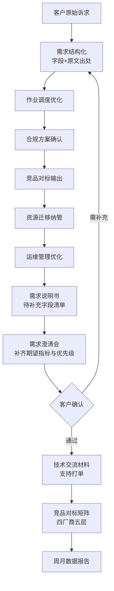

# 需求说明书 · REQ-2026-001

> 由 `src/doc_assembler.py` 自动装配。**客户场景为自拟，非真实业务数据。**

## 1. 需求信息
| 字段 | 值 |
|---|---|
| 来源渠道 | 客户现场 |
| 接收日期 | 2026-09-08 |
| 上报人 | 华东区售前 |
| 客户行业 | 政务 |

## 2. 业务场景描述

> 客户是省级政务云运维中心，现在虚拟机太多管理麻烦，希望能把非核心业务放到云上统一管。另外他们问华为云、阿里的同类产品我们能不能对标讲讲。还有就是他们现在的分布式训练任务排队太久，能不能优化下排队时间。数据都在他们机房，暂时不上公有云，这是硬要求。

## 3. 需求点清单（每个可追溯到原文）

| 编号 | 类型 | 原文依据 |
|---|---|---|
| RP-01 | 作业调度效率 | 「排队」；「排队」 |
| RP-02 | 合规与数据驻留 | 「机房」；「不上公有云」 |
| RP-03 | 竞品认知 | 「华为」；「阿里」；「对标」 |
| RP-04 | 资源迁移纳管 | 「放到云上」；「统一管」 |
| RP-05 | 运维管理效率 | 「运维」；「管理麻烦」 |

## 4. 约束条件

| 类型 | 原文 |
|---|---|
| 数据不上公有云 | 「不上公有云」 |
| 暂不上云 | 「暂时不上公有云」 |
| 数据驻留 | 「数据都在他们机房」 |
| 禁止项 | 「不能对标讲讲」 |

## 5. 字段完整度

**必填字段完整率 67%**（4/6）

**待补充字段**：优先级、期望指标

> 完整率是**需求澄清进度**的可测量指标，不是文档质量指标。需求刚收集时必然不完整 —— 需要在澄清会上补齐。

> 「期望指标」保持为「未提取到」—— **需求原文未给出可量化指标时不编数字**，由产品经理与客户在需求澄清会上补齐。

## 6. 需求流转流程图

> 流程图由代码生成（`src/prototype_helper.py`），纯文本可版本 diff —— 需求变更时能直接看到改了什么，这是手工画图做不到的。

## 7. 待明确事项

1. 期望指标：需求原文未给出可量化指标，**不编数字**，须在澄清会上与客户共同定义
2. 优先级：须结合客户业务窗口期确定
3. 数据驻留要求的具体范围（哪些数据必须留在机房、哪些可上云）
4. 竞品对标的业务口径：客户想对标的是能力还是价格

---
生成命令：`python -m src.cli`
