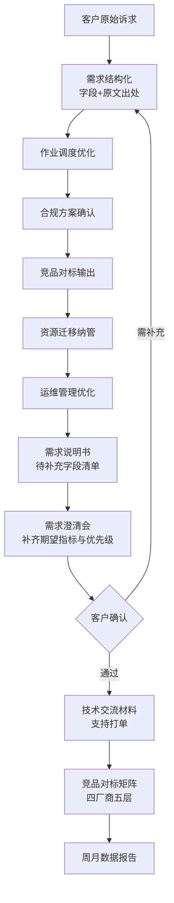

# 技术交流材料 · 政务

> 由 `src/doc_assembler.py` 自动装配。**客户场景为自拟，打单价格与商务条款不在本材料范围内。**

## 1. 客户当前状况

客户是省级政务云运维中心，现在虚拟机太多管理麻烦，希望能把非核心业务放到云上统一管。另外他们问华为云、阿里的同类产品我们能不能对标讲讲。还有就是他们现在的分布式训练任务排队太久，能不能优化下排队时间。数据都在他们机房，暂时不上公有云，这是硬要求。

## 2. 客户诉求与我们的对应能力

| 客户诉求 | 对应云产品层 | 我方能力域覆盖 |
|---|---|---|
| 作业调度效率 | PaaS / MASS | -、ai_platform、bigdata |
| 合规与数据驻留 | MASS（私有化） | -、ai_platform、bigdata |
| 竞品认知 | — | -、ai_platform、bigdata |
| 资源迁移纳管 | IaaS | -、ai_platform、bigdata |
| 运维管理效率 | PaaS | -、ai_platform、bigdata |

## 3. 竞品对标要点

| 云产品层 | 我方 | 华为云 | 阿里云 | 腾讯云 |
|---|---|---|---|---|
| 基础设施即服务 | 7 个 | 8 个 | 1 个 | 5 个 |
| 平台即服务 | 9 个 | 5 个 | 1 个 | 5 个 |
| 数据即服务 | 未查到 | 未查到 | 1 个 | 未查到 |
| 异构算力即服务 | 1 个 | 未查到 | 1 个 | 未查到 |
| 软件即服务 | 未查到 | 未查到 | 未查到 | 未查到 |

> 对标口径：只讲各厂商**在公开产品页上能查到的产品线**，不做优劣评价。客户结合自身场景判断，比我们替他判断更负责。

## 4. 实施路径

## 5. 待与客户确认

1. 期望指标：性能与成本的具体目标值（**本材料不代客户设定**）
2. 优先级与时间窗口
3. 数据驻留的具体范围
4. 预算与采购流程

---
生成命令：`python -m src.cli`
